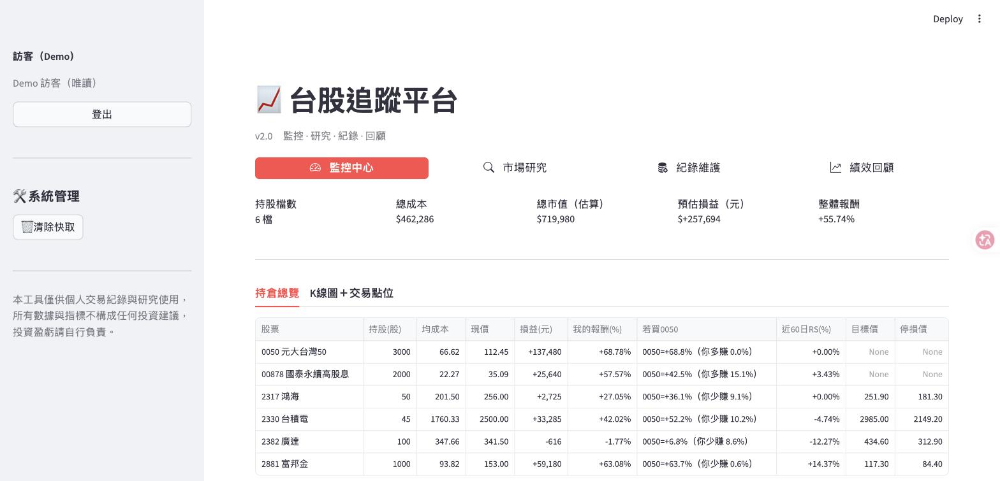
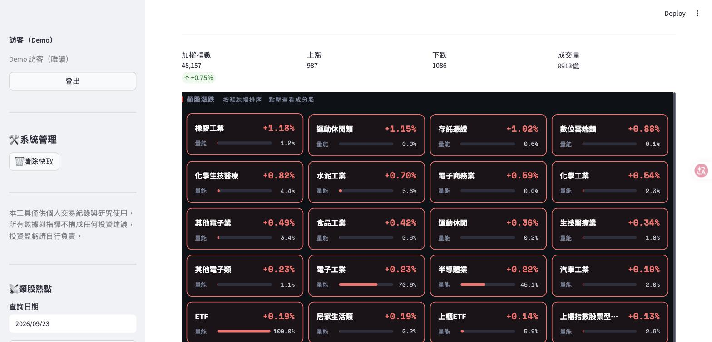
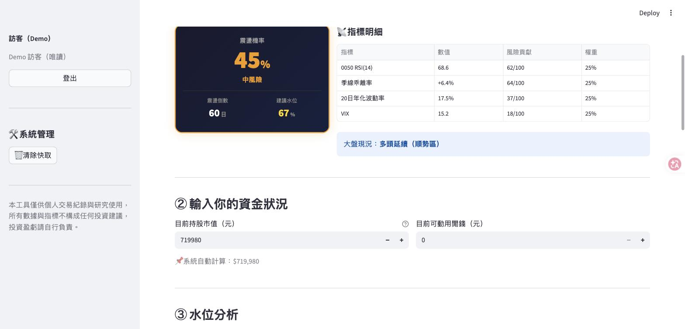
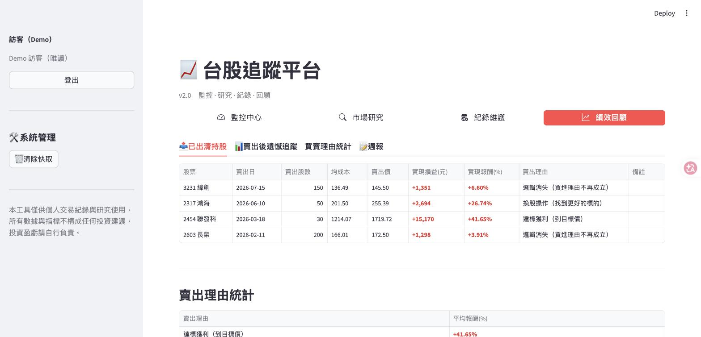

# 📈 WiseStock

一個用 Python + Streamlit 打造的台股投資追蹤平台，支援多帳號登入，
每個帳號各自管理自己的交易紀錄與持倉，並提供績效分析、市場籌碼雷達與技術分析工具。

<!-- 部署到 Streamlit Community Cloud 後，把下面這行的網址換成實際的 Demo 連結 -->
**🔗 線上 Demo：** DEMO_URL（點「以訪客身分瀏覽 Demo」即可，不需註冊）

| 監控中心 | 市場雷達 |
|---|---|
|  |  |
| **水位計算機** | **績效回顧** |
|  |  |

> 截圖為 Demo 模式的虛構交易資料。

## 功能特色

- **多帳號登入**：bcrypt 密碼雜湊、角色權限（管理員 / 一般用戶），每個帳號的交易紀錄互相隔離
- **持倉監控**：即時現價（TWSE/TPEX 官方資料優先，yfinance 備援）、相對強度（RS）、K 線圖標記實際買賣點位
- **交易紀錄管理**：手動新增、CSV 批次匯入（含格式驗證）、編輯、刪除
- **績效分析**：計算已實現損益
- **市場雷達**：三大法人買賣超、集保股權分散（大戶持股趨勢）、漲停股掃描、類股熱點
- **技術分析**：KD、RSI、OBV、相對強度、水位計算機（買賣點評分）
- **訪客 Demo 模式**：免註冊瀏覽所有頁面，使用虛構資料、所有寫入功能停用
- **策略參數外部化**：評分權重與門檻集中在設定檔，程式邏輯不寫死數字

## 技術棧

| 類別 | 使用技術 |
|------|----------|
| 前端/框架 | [Streamlit](https://streamlit.io/) |
| 資料庫 | SQLite（原生 `sqlite3`，無 ORM） |
| 資料處理 | pandas, numpy |
| 圖表 | Plotly |
| 股價資料 | TWSE/TPEX 官方 API（自建 CSV/JSON 解析與快取）、yfinance 備援 |
| 測試 | pytest |

## 架構

```
app.py                   路由、登入、Streamlit 快取包裝
│
├─ views/*.py             畫面（Streamlit UI，只負責渲染）
│    │
│    ├─ services/         業務邏輯與驗證（不依賴 Streamlit，可獨立測試）
│    │    ├─ trade_service.py   交易驗證、CSV 匯入
│    │    └─ scoring.py         買賣點評分、加減碼分類
│    └─ formatting.py      共用的格式化／上色 helper
│
├─ strategy.py             載入策略參數（strategy_config.py → strategy_defaults.py）
├─ demo.py                 訪客 Demo 模式
├─ database.py             交易紀錄讀寫 + FIFO 成本配對引擎
├─ auth.py                 帳號認證（bcrypt、users 表）
├─ stock_data.py           個股即時價格／技術指標
├─ market_radar_data.py    市場籌碼掃描（法人／集保／漲停股）
└─ market_radar_db.py      集保歷史資料庫
```

畫面（views）與商業邏輯（services、database）分層，讓驗證邏輯與成本計算
可以脫離 Streamlit 直接被 pytest 測試，不需要啟動整個網頁應用程式。

## 快速開始

```bash
git clone https://github.com/Nancyuning/WiseStock.git
cd WiseStock

python3 -m venv .venv
source .venv/bin/activate
pip install -r requirements.txt

cp .env.example .env   # 選填：填入 FinMind token 以啟用法人/集保資料

streamlit run app.py
```

第一次啟動會自動建立 `data/auth.db` 與一組管理員帳號 `admin`，
**初始密碼會隨機產生並顯示在終端機**（只顯示這一次）。
也可以在第一次啟動前用環境變數自訂：

```bash
WISESTOCK_ADMIN_PASSWORD='你的密碼' streamlit run app.py
```

登入後建議到側邊欄修改密碼。

> ⚠️ 本專案定位為個人 / 區網使用，登入機制沒有防暴力破解等保護，
> 不建議直接對公開網路開放。

## 策略參數

所有「評分權重、門檻、加減碼規則」都放在設定檔裡，程式邏輯本身不寫死任何數字：

| 檔案 | 用途 | 是否 commit |
|---|---|---|
| `strategy_defaults.py` | 公開版預設值（一般教科書等級的參數） | ✅ |
| `strategy_config.py` | 自己調整過的參數，結構與預設檔相同 | ❌ 已被 `.gitignore` 排除 |

`strategy.py` 會優先載入 `strategy_config.py`，沒有的話就用預設值。
想調整參數：`cp strategy_defaults.py strategy_config.py` 後修改即可。
畫面上顯示的權重、門檻說明也會跟著設定檔自動更新。

## Demo 模式與部署

設定環境變數 `WISESTOCK_DEMO=1`，登入頁就會多一個「以訪客身分瀏覽 Demo」按鈕：

- 訪客看到的是 `demo/demo_trades.csv` 的虛構交易紀錄，跟真實帳號的資料完全隔離
- 新增、匯入、編輯、刪除、修改密碼等寫入功能全部隱藏
- 沒設定這個變數時（例如自己在家裡跑），Demo 功能完全不會出現

部署到 [Streamlit Community Cloud](https://streamlit.io/cloud)：
選擇這個 repo、主程式填 `app.py`，在 **Advanced settings → Secrets** 加上：

```toml
WISESTOCK_DEMO = "1"
FINMIND_TOKEN = "你的 token"   # 選填
```

> Streamlit Cloud 的 sqlite 會在重新部署時清空，Demo 資料會在訪客第一次登入時自動重新載入。

## 測試

`database.py` 的持倉/損益計算、`stock_data.py` 的技術指標
（KD、OBV、RS、Forward P/E）、`services/trade_service.py` 的交易驗證邏輯、
`services/scoring.py` 的評分與加減碼分類、Demo 模式的資料隔離，
都有對應的 pytest 單元測試，跑在跟正式資料庫隔離的暫存 sqlite 檔案上，
不會動到 `data/trades.db`，也不需要連網路。

```bash
pip install -r requirements-dev.txt
pytest
```

## 專案結構

```
.
├── app.py                    主入口：登入、導覽、頁面路由
├── auth.py                   帳號認證
├── database.py                交易紀錄讀寫、FIFO 成本配對引擎
├── formatting.py               共用格式化/上色 helper
├── stock_data.py              個股價格與技術指標
├── market_radar_data.py       市場籌碼掃描（法人/集保/漲停股）
├── market_radar_db.py          集保歷史資料庫
├── market_radar_ui.html        市場雷達的嵌入式圖表元件
├── stock_chart_widget.py       K 線圖元件
├── strategy.py                 載入策略參數
├── strategy_defaults.py        公開版策略參數預設值
├── demo.py                     訪客 Demo 模式
├── demo/
│   └── demo_trades.csv         Demo 用的虛構交易紀錄
├── services/
│   ├── trade_service.py       交易驗證與業務邏輯
│   └── scoring.py             買賣點評分、加減碼分類
├── views/
│   ├── monitor.py             監控中心（持倉總覽 + K 線）
│   ├── research.py            市場研究（法人/集保/個股分析）
│   ├── trades.py               紀錄維護（新增/匯入/編輯交易）
│   ├── analytics.py            績效回顧（已實現損益/理由統計/週報）
│   └── admin.py                帳號管理（管理員專用）
├── tests/                      pytest 單元測試
└── docs/screenshots/           README 截圖
```

## 免責聲明

本專案僅供個人交易紀錄與程式學習研究使用。畫面中的「建議加碼 / 減碼 / 持股水位」
等文字皆為程式依技術指標自動計算的結果，**不構成任何投資建議**；
股價與籌碼資料來自 TWSE、TPEX、FinMind、yfinance 等第三方來源，不保證即時或正確。
投資盈虧請自行負責。

## License

本專案採用 [PolyForm Noncommercial License 1.0.0](LICENSE)，屬於「原始碼公開」授權：

- ✅ 可以自由閱讀、學習、修改，用於個人、研究、教育等**非商業**用途
- ❌ 不得用於商業用途（例如包裝成付費服務或產品）

如需商業授權，請透過 GitHub 聯繫作者。
