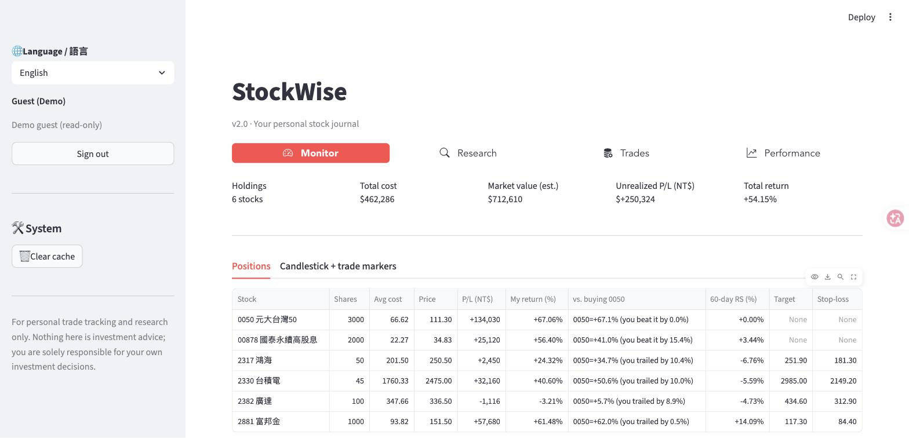
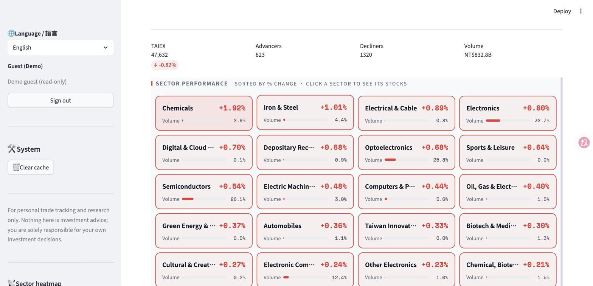
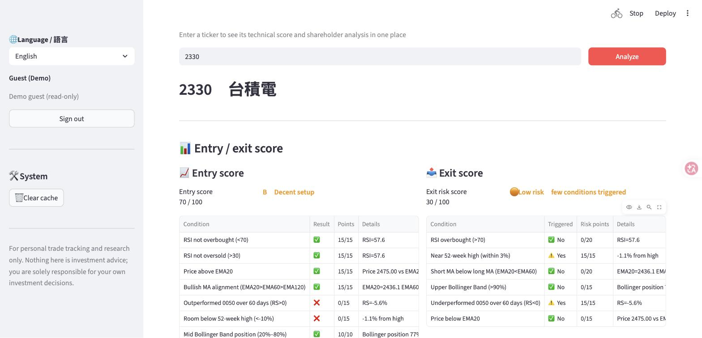
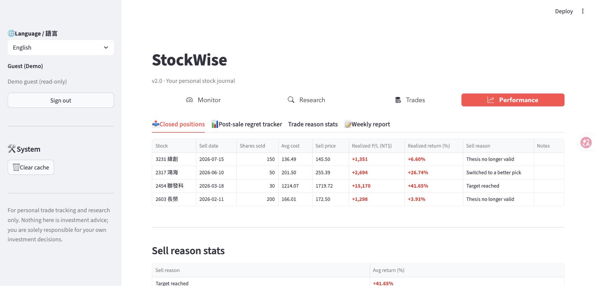

# WiseStock

**English** | [繁體中文](README.zh-TW.md)

A Taiwan stock portfolio tracker built with Python + Streamlit. Multiple users each manage
their own trades and holdings, with performance analytics, a market-flow radar
(institutional investors, shareholder distribution, limit-up scans, sector heatmap)
and technical analysis tools. The UI is bilingual: **English / 繁體中文**.

**🔗 Live demo:** <https://wisestock-demo.streamlit.app> — click **"Explore the demo as a guest"**,
no sign-up needed. (The app sleeps when idle; the first load may take ~30 seconds.)

| Monitor | Market radar |
|---|---|
|  |  |
| **Stock analysis** | **Performance** |
|  |  |

> Screenshots show fictional trades from demo mode.

## Features

- **Multi-user sign-in** — bcrypt password hashing, roles (admin / user), per-user data isolation
- **Portfolio monitor** — live prices (official TWSE/TPEx data first, yfinance fallback), relative strength vs. 0050, candlestick charts with your actual buy/sell points
- **Trade journal** — manual entry, CSV bulk import with validation, edit, delete
- **Performance review** — exit-reason statistics, post-sale tracking, weekly report
- **Market radar** — institutional net buy/sell, TDCC shareholder distribution (whale vs. retail trends), limit-up scanner, sector heatmap
- **Stock analysis** — KD, RSI, OBV, relative strength, rule-based buy/sell scoring
- **Bilingual UI** — English / 繁體中文, switchable from the sidebar
- **Guest demo mode** — browse every page with fictional data; all write actions disabled
- **Externalized strategy parameters** — scoring weights and thresholds live in a config file, not in code

## Tech stack

| Area | Technology |
|------|------------|
| UI / framework | [Streamlit](https://streamlit.io/) |
| Database | SQLite (plain `sqlite3`, no ORM) |
| Data processing | pandas, numpy |
| Charts | Plotly |
| Market data | TWSE / TPEx official APIs (custom CSV/JSON parsing and caching), FinMind, yfinance fallback |
| Tests | pytest |

## Architecture

```
app.py                   routing, sign-in, Streamlit cache wrappers
│
├─ views/*.py             UI (Streamlit, rendering only)
│    │
│    ├─ services/         business logic & validation (no Streamlit dependency, unit-testable)
│    │    ├─ trade_service.py   trade validation, CSV import
│    │    └─ scoring.py         buy/sell scoring
│    └─ formatting.py      shared formatting / colour helpers
│
├─ i18n.py + locales/      translations: t("原文") → English / 繁體中文
├─ strategy.py             loads strategy parameters (strategy_config.py → strategy_defaults.py)
├─ demo.py                 guest demo mode
├─ database.py             trade storage + FIFO cost-matching engine
├─ auth.py                 authentication (bcrypt, users table)
├─ stock_data.py           prices & technical indicators
├─ market_radar_data.py    market-flow scans (institutional / TDCC / limit-up)
└─ market_radar_db.py      TDCC history database
```

Views are kept separate from business logic (services, database), so validation and cost
calculations are tested directly with pytest without starting the web app.

### How the bilingual UI works

UI strings are wrapped as `t("中文原文")`. The Chinese text is the key, and English
translations live in `locales/en_*.py` (one file per module, merged automatically).
Values stored in the database (buy/sell, trade reasons, market condition) always stay
canonical, and are only translated for display. A test scans the codebase and fails if any
`t("…")` string is missing an English translation.

## Getting started

```bash
git clone https://github.com/Nancyuning/WiseStock.git
cd WiseStock

python3 -m venv .venv
source .venv/bin/activate
pip install -r requirements.txt

cp .env.example .env   # optional: add a FinMind token for institutional / TDCC data

streamlit run app.py
```

On first launch `data/auth.db` is created with an `admin` account.
**The initial password is randomly generated and printed to the terminal** (shown only once).
You can set it yourself before the first launch:

```bash
WISESTOCK_ADMIN_PASSWORD='your-password' streamlit run app.py
```

Change the password from the sidebar after signing in.

> ⚠️ This project is designed for personal / LAN use. Sign-in has no brute-force protection,
> so don't expose a non-demo instance directly to the internet.

## Strategy parameters

Scoring weights and thresholds are kept in config files, never hard-coded:

| File | Purpose | Committed |
|---|---|---|
| `strategy_defaults.py` | Public defaults (textbook-level parameters) | ✅ |
| `strategy_config.py` | Your own tuned parameters, same structure | ❌ excluded by `.gitignore` |

`strategy.py` loads `strategy_config.py` if it exists, otherwise the defaults.
To tune: `cp strategy_defaults.py strategy_config.py` and edit. The weights and thresholds
shown in the UI update automatically.

## Demo mode & deployment

Set `WISESTOCK_DEMO=1` and the sign-in page shows an **"Explore the demo as a guest"** button:

- Guests see fictional trades from `demo/demo_trades.csv`, fully isolated from real accounts
- Adding, importing, editing, deleting and password changes are hidden
- Without the variable (e.g. running at home), demo mode doesn't appear at all

To deploy on [Streamlit Community Cloud](https://streamlit.io/cloud): pick this repo, set the
main file to `app.py`, and add under **Advanced settings → Secrets**:

```toml
WISESTOCK_DEMO = "1"
FINMIND_TOKEN = "your-token"   # optional
```

> Streamlit Cloud's SQLite is reset on redeploy; demo data reloads automatically on the first guest visit.

## Tests

Position and P/L calculations (`database.py`), technical indicators (`stock_data.py`: KD, OBV,
RS, forward P/E), trade validation (`services/trade_service.py`), scoring (`services/scoring.py`),
demo-mode isolation and translation coverage all have pytest tests. They run against a
throwaway SQLite file, never touch `data/trades.db`, and need no network access.

```bash
pip install -r requirements-dev.txt
pytest
```

## Project structure

```
.
├── app.py                    entry point: sign-in, navigation, routing
├── auth.py                   authentication
├── database.py               trade storage, FIFO cost-matching engine
├── formatting.py             shared formatting / colour helpers
├── i18n.py                   translation helper t() and language picker
├── locales/                  English translations (en_*.py)
├── stock_data.py             prices and technical indicators
├── market_radar_data.py      market-flow scans (institutional / TDCC / limit-up)
├── market_radar_db.py        TDCC history database
├── market_radar_ui.html      embedded market-radar component
├── stock_chart_widget.py     candlestick chart component
├── strategy.py               loads strategy parameters
├── strategy_defaults.py      public default strategy parameters
├── demo.py                   guest demo mode
├── demo/
│   └── demo_trades.csv       fictional demo trades
├── services/
│   ├── trade_service.py      trade validation and business logic
│   └── scoring.py            buy/sell scoring
├── views/
│   ├── monitor.py            Monitor (holdings + candlestick chart)
│   ├── research.py           Research (market scan / stock analysis / charts)
│   ├── trades.py             Trades (add / import / edit)
│   ├── analytics.py          Performance (realized P/L / reason stats / weekly report)
│   └── admin.py              Accounts (admin only)
├── tests/                    pytest tests
└── docs/screenshots/         README screenshots
```

## Disclaimer

This project is for personal trade tracking and programming research only. Any
"buy / sell" wording in the UI is produced automatically from technical indicators and is
**not investment advice**. Price and market-flow data come from third parties (TWSE, TPEx,
FinMind, yfinance) and are not guaranteed to be timely or accurate. You are solely
responsible for your own investment decisions.

## License

Licensed under the [PolyForm Noncommercial License 1.0.0](LICENSE) — a *source-available* license:

- ✅ Free to read, learn from, modify and use for personal, research and educational (**non-commercial**) purposes
- ❌ No commercial use (e.g. offering it as a paid service or product)

For commercial licensing, please contact the author via GitHub.
